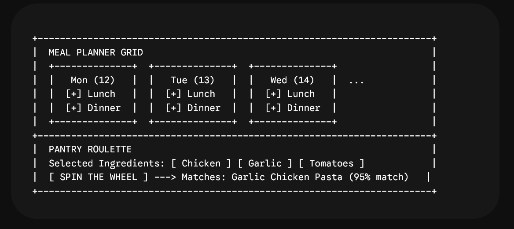

# 🍳 Dinerforged — AI & Data Science Powered Culinary Operating System

Dinerforged is an AI-augmented Progressive Web App (PWA) designed for home cooks, culinary enthusiasts, and meal planners. Built with a local-first architecture, it pairs modern web performance with food science algorithms, non-linear mathematical ratio scaling, machine learning models, and hybrid AI integrations (OpenRouter Free Tier / Groq + Local Client-Side Fallbacks).

---

## 🚀 Key Features

- 🌍 **World Recipes & Smart Scaler:** Explore rich global recipes with non-linear logarithmic ingredient ratio scaling (spices and leaveners decay cleanly so flavor balance remains intact when yields scale).
- ✏️ **Full Local Custom Recipe CRUD:** Create, read, update, and delete your own custom recipes with persistence in local storage.
- 🧪 **Techniques & Utensils Encyclopedias:** Deep-dive into food science explanations, common mistakes, and equipment care guides.
- 📅 **Smart Meal Planner & Pantry Roulette:** 7-day planning grid featuring an Inventory Reuse Index optimizer and a "What Can I Cook Right Now?" matching algorithm.
- 🛒 **Auto-Aggregated Shopping List:** Automatically parses, normalizes, scales, and categorizes grocery items into Produce, Pantry, Dairy, Meat, Seafood, Spices, and Oil & Fat.
- ⏱️ **Global Kitchen Timer Suite:** Multi-timer management store powered by Zustand, featuring Web Audio API synthesized chime alerts and a floating quick-timer widget (`SmartKitchenAssistant.tsx`).
- 🗣️ **Hands-Free Cooking Mode:** Full-screen step-by-step guidance featuring strict female-only voice narration (`useRecipeVoice.ts`) and sequential auto-listening voice commands ("Next" / "Back").
- ☁️ **Google Drive Cloud Sync & Backups:** Secure, private user data backups (`dinerforged-backup.json`) via Google Identity Services OAuth 2.0 (`googleDriveSync.ts`).
- 🤖 **Hybrid AI Chef Companion:** OpenRouter Free Tier / Groq serverless proxy for ingredient substitutions, troubleshooting, and wine pairings, backed by local offline vector search.
- 📷 **Vision Pantry & Recipe OCR:** Scan ingredient photos or raw recipe text directly into structured JSON.
- 📱 **Full Offline PWA:** Instant installability, Workbox caching, iOS Safari install prompts, and offline state handling.

---

## 🛠️ Tech Stack

- **Frontend Framework:** React 18 + TypeScript + Vite
- **Styling:** Tailwind CSS v3 (Custom culinary theme design system + Dark/Light mode)
- **State Management:** Zustand (With `persist` middleware for LocalStorage & global timer store)
- **Routing:** React Router v6
- **PWA & Caching:** `vite-plugin-pwa` + Workbox
- **Backend Infrastructure:** Netlify Serverless Functions (TypeScript)
- **AI Engine:** OpenRouter / Groq Free APIs (`llama-3.3-70b-versatile`, `llama-3.2-11b-vision-instruct:free`) + Local Vector Search
- **Voice / Audio APIs:** Web Speech API (TTS/STT) & Web Audio API (Chime Synthesizer)
- **Icons:** Lucide React (`lucide-react`)

---

## 🧬 Data Science & AI Integrations

1. **Non-Linear Ratio Scaler (`smartScaler.ts`):** Replaces linear multiplication with category-aware power scaling ($\alpha = 0.75$ for spices, $\alpha = 0.65$ for leaveners) to prevent over-seasoning at high yields.
2. **Flavor Vector Search (`vectorSearch.ts`):** Uses Cosine Similarity across flavor matrices (Sweet, Savory, Acid, Fat, Umami, Bitter) to recommend ingredient substitutions offline.
3. **Inventory Reuse Optimizer (`planOptimizer.ts`):** Minimizes food waste by scoring weekly meal plans based on overlapping partial ingredients.
4. **Thermal Physics Estimator (`physicsEstimator.ts`):** Adjusts cooking timer durations based on cookware material thermal mass (Cast Iron vs. Stainless Steel) and yield scale.
5. **Vision OCR & NLP Extractor (`parse-recipe.ts`):** Parses raw image inputs or text into structured JSON matching the app's `Recipe` schema.
6. **Contextual AI Chat (`ai-chef.ts`):** Injects active recipe context into free serverless AI prompts for real-time culinary troubleshooting.

---

## 💻 Local Development Setup

1. **Install dependencies:**

   ```bash
   npm install

 //Touch-Friendly Meal Planner Grid layout

//Folder Structure:

dinerforged/
├── .github/
│   └── workflows/
│       └── ci.yml
├── netlify/
│   └── functions/
│       ├── ai-chef.ts            <-- OpenRouter / Groq proxy
│       └── parse-recipe.ts       <-- Vision OCR parser
├── public/
│   ├── favicon.ico
│   ├── pwa-192x192.png
│   └── pwa-512x512.png
├── src/
│   ├── components/
│   │   ├── common/
│   │   │   └── OfflineBanner.tsx
│   │   ├── layout/
│   │   │   ├── MobileDrawer.tsx
│   │   │   ├── MobileNav.tsx
│   │   │   └── Navbar.tsx
│   │   ├── modals/
│   │   │   └── CloudSyncModal.tsx
│   │   ├── planner/
│   │   │   ├── FlavorAnalyticsWidget.tsx
│   │   │   ├── PantryRouletteModal.tsx
│   │   │   └── RecipePickerModal.tsx
│   │   ├── pwa/
│   │   │   └── IOSInstallPrompt.tsx
│   │   ├── recipes/
│   │   │   ├── CustomRecipeModal.tsx
│   │   │   ├── HandsFreeCookingMode.tsx
│   │   │   ├── RecipeCard.tsx
│   │   │   └── ServingScaler.tsx
│   │   ├── techniques/
│   │   │   └── TechniqueCard.tsx
│   │   ├── timers/
│   │   │   └── SmartKitchenAssistant.tsx
│   │   └── utensils/
│   │       └── UtensilCard.tsx
│   ├── data/
│   │   ├── recipes.ts
│   │   ├── techniques.ts
│   │   └── utensils.ts
│   ├── hooks/
│   │   ├── useOnlineStatus.ts
│   │   ├── usePWAInstall.ts
│   │   ├── useRecipeVoice.ts
│   │   └── useTheme.ts
│   ├── pages/
│   │   ├── AIChefPage.tsx
│   │   ├── FavoritesPage.tsx
│   │   ├── MealPlannerPage.tsx
│   │   ├── RecipesPage.tsx
│   │   ├── ShoppingListPage.tsx
│   │   └── TechniquesPage.tsx
│   ├── services/
│   │   └── googleDriveSync.ts
│   ├── store/
│   │   ├── useAppStore.ts
│   │   └── useTimerStore.ts
│   ├── types/
│   │   └── index.ts
│   └── utils/
│       ├── aggregator.ts
│       ├── physicsEstimator.ts
│       ├── planOptimizer.ts
│       ├── pwaRegister.ts
│       ├── smartScaler.ts
│       └── vectorSearch.ts
│   ├── App.tsx
│   ├── index.css
│   └── main.tsx
├── .dockerignore
├── .gitignore
├── Dockerfile
├── index.html
├── netlify.toml
├── nginx.conf
├── package.json
├── postcss.config.js
├── README.md
├── tailwind.config.js
├── tsconfig.json
└── vite.config.ts
